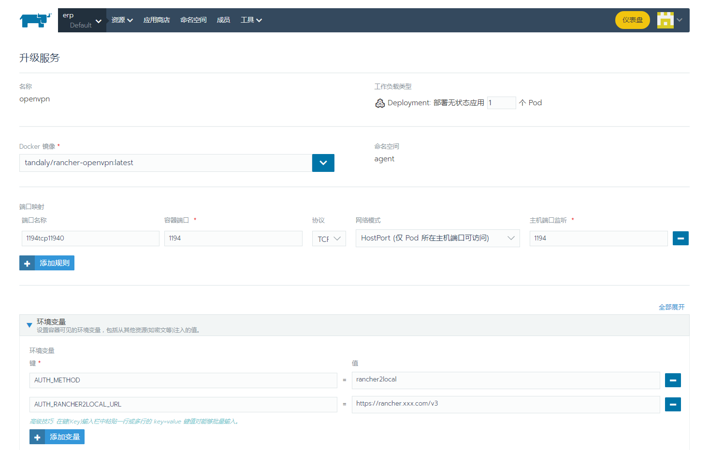
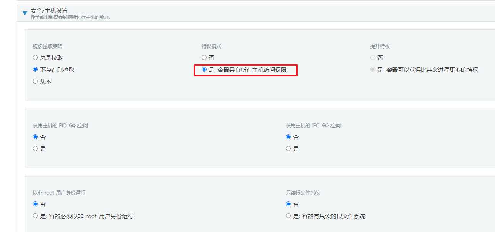
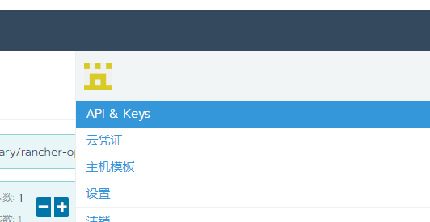
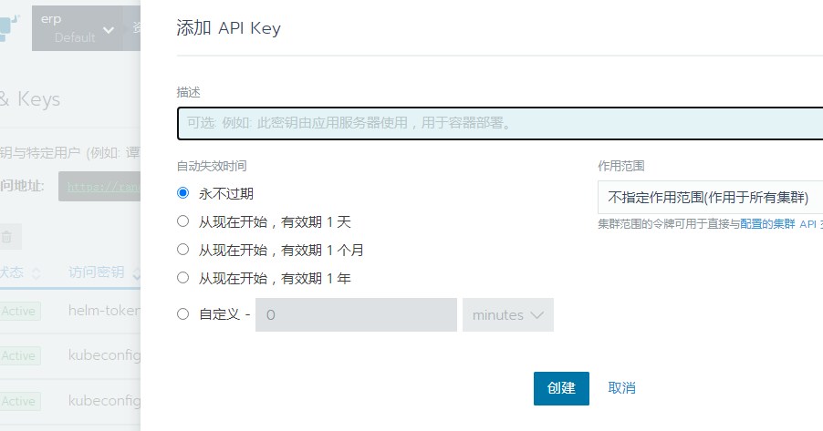

# OpenVPN for Rancher with modular authentication


[docker](https://hub.docker.com/repository/docker/tandaly/rancher-openvpn/builds)

[阿里云](https://cr.console.aliyun.com/repository/cn-hangzhou/tandaly/rancher-openvpn/build)


OpenVPN server image made to give access to Rancher network with modular authentication.

This Server doesn't relies on clients certificates, but on credential based authentication

Current version is shipped with following authentication :
- httpbasic
- httpdigest
- ldap
- rancherlocal
- rancher2local

---

## How to configure the image

**The only mandatory variables are AUTH_METHOD, and method dependant variables.**

Each non mandatory environment variable is optionnal and has default value.

Following variables are the answers to common questions during certificate 
creation process 
- CERT_COUNTRY="US"
- CERT_PROVINCE="AL"
- CERT_CITY="Birmingham"
- CERT_ORG="ACME"
- CERT_EMAIL="nobody@example.com"
- CERT_OU="IT"

These variables define the network address and CIDR netmask for the ip pool which 
will be the VPN subnet for OpenVPN to draw client addresses from
- VPNPOOL_NETWORK="10.43.0.0"
- VPNPOOL_CIDR="16"

Next two variables are used in client configuration generation process, 
to indicate OpenVPN clients where to connect to establish the link
- REMOTE_IP="ipOrHostname"
- REMOTE_PORT="1194"

If you don't want to expose the full Rancher network, you can set your own network
and netmask with following variables:
- ROUTE_NETWORK="10.42.0.0"
- ROUTE_NETMASK="255.255.0.0"

If you don't want to expose the interunal Rancher metadata api, you can set any 
value to this variable, it will prevent to add the route to metadata api. Default
is to expose the metadata api, in this case this variable is empty.
- NO_RANCHER_METADATA_API="" => expose metadata api
- NO_RANCHER_METADATA_API="1" => do not expose metadata api

You can also set your custom search domain and DNS server pushed to VPN clients:
- PUSHDNS="169.254.169.250"
- PUSHSEARCH="rancher.internal"

There is also an optionnal variable to let you customize OpenVPN server config, 
for example to push your own custom route. This variable accept multiple line by
adding a simple \n between lines.
- OPENVPN_EXTRACONF="first line\nsecond line\nthird line"

---

## How to run this image

**You must have to run this image with privileged mode.**

Here is the minimal docker run example with **httpbasic** authentication :
```sh
docker run -d --privileged=true -p 1194:1194 \
    -e AUTH_METHOD=httpbasic \
    -e AUTH_HTTPBASIC_URL=https://api.github.com/user \
    tandaly/rancher-openvpn
```

And here is an exhaustive docker run example with ldap authentication :
```sh
docker run -d \
    --privileged=true \
    -e REMOTE_IP=1.2.3.4 \
    -e REMOTE_PORT=1194 \
    -e CERT_COUNTRY=FR \
    -e CERT_PROVINCE=PACA \
    -e CERT_CITY=Marseille \
    -e CERT_ORG=MDNS \
    -e CERT_EMAIL=none@example.com \
    -e CERT_OU=IT \
    -e VPNPOOL_NETWORK=10.8.0.0 \
    -e VPNPOOL_CIDR=24 \
    -e OPENVPN_EXTRACONF='# Example of multiline extraconf\npush "10.10.0.0 255.255.0.0"\npush "10.20.0.0 255.255.0.0"'
    -e ROUTE_NETWORK=10.42.103.143 \
    -e ROUTE_NETMASK=255.255.255.255 \
    -e PUSHDNS=169.254.169.250 \
    -e PUSHSEARCH=rancher.internal \
    -e NO_RANCHER_METADATA_API=1 \
    -e AUTH_METHOD=ldap \
    -e AUTH_LDAP_URL=ldap://ldap.acme.tld \
    -e AUTH_LDAP_BASEDN='dc=acme,dc=tld' \
    -e AUTH_LDAP_SEARCH='(uid=$username)' \
    -e AUTH_LDAP_BINDDN='cn=admin,dc=acme,dc=tld' \
    -e AUTH_LDAP_BINDPWD='thisIsTheBindDnPassword' \
    -v /etc/openvpn \
    --name=vpn \
    -p 1194:1194 \
    tandaly/rancher-openvpn
```

Note bene : First launch takes more time because of certificates and private keys generation
process

---

## Authentication methods

### HTTP Basic

Authentication is made by trying to connect to a HTTP Server with credentials in Basic HTTP Auth mechanism.

Each variable is mandatory :
- AUTH_METHOD=httpbasic
- AUTH_HTTPBASIC_URL is the http server url, ex : AUTH_HTTPBASIC_URL='http[s]://hostname[:port][/uri]'

You can test authentication against the GitHub api server :
```sh
docker run -d --privileged=true -p 1194:1194 \
    -e AUTH_METHOD=httpbasic \
    -e AUTH_HTTPBASIC_URL=https://api.github.com/user \
    tandaly/rancher-openvpn
```

**Warning ! If you use GitHub api url in production, anyone who has a github account will be able to connect your VPN !!**

### HTTP Digest

Authentication is made by trying to connect to a HTTP Server with credentials in Digest HTTP Auth mechanism.

Each variable is mandatory :
- AUTH_METHOD=httpdigest
- AUTH_HTTPDIGEST_URL is the http server url, ex : AUTH_HTTPDIGEST_URL='http[s]://hostname[:port][/uri]'

You can test authentication against the httpbin sandbox server :
```sh
docker run -d --privileged=true -p 1194:1194 \
    -e AUTH_METHOD=httpdigest \
    -e AUTH_HTTPDIGEST_URL=https://httpbin.org/digest-auth/auth/myuser/mypwd \
    tandaly/rancher-openvpn
```


### LDAP

Authentication is made by trying to connect a ldap server with client credentials

These are mandatory variable to setup ldap authentication :

- AUTH_METHOD=ldap
- AUTH_LDAP_URL is the server address in URL format : AUTH_LDAP_URL=ldap[s]://hostnameOrIp[:port]
- AUTH_LDAP_BASEDN is the base DN to search for, ex: AUTH_LDAP_BASEDN='dc=acme,dc=com'
- AUTH_LDAP_SEARCH is the ldap search pattern to find user's dn, with a parameter $username, ex : AUTH_LDAP_SEARCH='(uid=$username)'

If your ldap server need to be authenticated to search directory, you can use optionnals binding variables: 

- AUTH_LDAP_BINDDN : DN to use in searching processs
- AUTH_LDAP_BINDPWD : password associated

You can test ldap authentication with osixia/openldap ldap docker image, with login "admin" :
```
docker run -d --name=ldap -e LDAP_ORGANISATION="ACME" -e LDAP_DOMAIN="acme.tld" -e LDAP_ADMIN_PASSWORD="mypwd" osixia/openldap:1.1.1
docker run -d --privileged=true -p 1194:1194 --link ldap:ldapsrv \
    -e AUTH_METHOD=ldap \
    -e AUTH_LDAP_URL=ldap://ldapsrv \
    -e AUTH_LDAP_BASEDN='dc=acme,dc=com' \
    -e AUTH_LDAP_SEARCH='(uid=$username)' \
    -e AUTH_LDAP_BINDDN='cn=admin,dc=acme,dc=tld' \
    -e AUTH_LDAP_BINDPWD='mypwd' \
    tandaly/rancher-openvpn
```
---

### Rancher Server in local mode

Authentication is made by trying to connect to a Rancher Server configured in local mode.

Each variable is mandatory :
- AUTH_METHOD=rancherlocal
- AUTH_RANCHERLOCAL_URL is the http server url, ex : AUTH_RANCHERLOCAL_URL='http[s]://hostname[:port]/v1/token'

You can test authentication against the Rancher api server :
```sh
docker run -d --privileged=true -p 1194:1194 \
    -e AUTH_METHOD=rancherlocal \
    -e AUTH_RANCHERLOCAL_URL=https://rancher.example.com/v1/token \
    tandaly/rancher-openvpn
```

### Rancher2 Server in local mode

Authentication is made by trying to connect to a Rancher2 Server configured in local mode.

Each variable is mandatory :
- AUTH_METHOD=rancher2local
- AUTH_RANCHER2LOCAL_URL is the http server url, ex : AUTH_RANCHER2LOCAL_URL='http[s]://hostname[:port]/v3'

You can test authentication against the Rancher2 api server :
```sh
docker run -d --privileged=true -p 1194:1194 \
    -e AUTH_METHOD=rancher2local \
    -e AUTH_RANCHER2LOCAL_URL=https://rancher.example.com/v3 \
    tandaly/rancher-openvpn
```

## Client configuration

The client configuration is printed at dock start on stdout, but you can also 
retrieve it through the "vpn_get_client_config.sh" script.

```sh
docker exec -it vpn bash
root@35972bb51cc9:/# vpn_get_client_config.sh
remote $REMOTE_IP $REMOTE_PORT
client
dev tun
proto tcp
remote-random
resolv-retry infinite
cipher AES-128-CBC
auth SHA1
nobind
link-mtu 1500
persist-key
persist-tun
comp-lzo
verb 3
auth-user-pass
auth-retry interact
ns-cert-type server
<ca>
-----BEGIN CERTIFICATE-----
MIIEkjCCA3qgAwIBAgIJALhlg01BvAIvMA0GCSqGSIb3DQEBCwUAMIGMMQswCQYD
...
[Your generated OpenVPN CA certificate]
...
X0yOqF6doV0+DPt5T+vEeu9oiczscg==
-----END CERTIFICATE-----
</ca>
```

Save this configuration in your ".ovpn" file, don't forget to replace IPADDRESS 
and PORT with your server ip and the exposed port to reach OpenVPN server

Here is an example of a final client.ovpn :

```
remote 5.6.7.8 1194
client
dev tun
proto tcp
remote-random
resolv-retry infinite
cipher AES-128-CBC
auth SHA1
nobind
link-mtu 1500
persist-key
persist-tun
comp-lzo
verb 3
auth-user-pass
auth-retry interact
ns-cert-type server
<ca>
-----BEGIN CERTIFICATE-----
MIIEkjCCA3qgAwIBAgIJALhlg01BvAIvMA0GCSqGSIb3DQEBCwUAMIGMMQswCQYD
...
[Your generated OpenVPN CA certificate]
...
X0yOqF6doV0+DPt5T+vEeu9oiczscg==
-----END CERTIFICATE-----
</ca>
```
---

## Volumes and data conservation

Everything is stored in `/etc/openvpn`.


## 教程之 rancher2 搭建 openvpn 服务


部署 openvpn 服务







获取 ovpn，openvpn 客户端连接时用，`ipOrHostname` 改成 openvpn 服务器的 ip


新建 rancher2 登录用户名和密码







最后下载 openvpn 客户端，导入ovpn 配置文件，连接输入用户名和密码即可。


## 通过客户端连接


openvpn下载地址：https://openvpn.net/community-downloads/


## 来源：

https://hub.docker.com/r/mdns/rancher-openvpn

https://github.com/mdnsfr/docker-rancher-openvpn